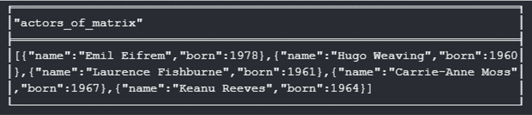

# Einführung in Cypher

Cypher erinnert an eine Kreuzung zwischen SQL, Regulären Ausdrücke und ASCII Art

```
(n)-->(m)
```

```
(n:Person)-[r]->(m:Person)
```

```
(n:Person)-[r:IS_FRIEND_WITH*1:2]->(m:Person)
```

## MATCH

Äquivalent zum SELECT Statement in SQL.

```
MATCH (p:Person)
RETURN p;
```

Liefert alle Knoten mit dem Label „Person“.

Auch Projektionen (Zugriff auf einzelne Attribute) sind möglich.

```
MATCH (p:Person)
RETURN p.name, p.born;
```

Liefert alle Beziehungen die zwischen zwei Personen n und m existieren. Aber welche Daten kommen hier genau an? 


### Vorsicht beim Kreuzprodukt

```
MATCH (p:Person)
MATCH (m:Movie)
RETURN p.name, m.title;
```

Zwei unabhängige Match-Statments bilden ein Kreuzprodukt. Im Fall der Movie Database entsteht hier eine Liste mit `131*38=4978` Einträgen. Die Kombination jeder Person mit jedem Film.

## RETURN
Im RETURN kann die zurückzugebende Projektion beeinflusst werden
- `*` liefert alle variablen zurück, die im aktuellen Abschnitt der Query gültig sind
- n, m, r liefert nur die genannten Variablen zurück
- DISTINCT gibt nur eindeutige Zeilen im Ergebnis zurück. Duplikate werden entfernt
- ORDER BY n.prop / ORDER BY n.prop DESC sortiert die Ergebnisliste
- SKIP 10 überspringt die ersten 10 Ergebnisse
- LIMIT 10 reduziert das Ergebnis auf die ersten 10 Ergebnisse
- Count(*) Aggregationsfunktion die alle Ergebnisse zusammenzählt

## Aggregationsfunktionen
- COUNT(*) Zählt die Anzahl der Zeilen im Ergebnis
- COUNT(var) / COUNT(DISTINCT var): Zählt alle nicht null Werte bzw. alle eindeutigen Werte
- SUM(var) Summiert nummerische Werte
- MIN(var) / MAX(var) liefert den kleinsten/größten Wert
- COLLECT(var) / COLLECT(DISTINCT var) Erstellt eine Liste aller (eindeutigen) übergebenen Werte

### min()

```
MATCH (p:Person)
WITH min(p.born) as oldest
MATCH (p:Person)
WHERE p.born = oldest
RETURN p.name, p.born;
```

### collect()

```
MATCH (:Movie {title: "The Matrix"})<-[:ACTED_IN]-(p:Person)
RETURN collect(p) as actors_of_matrix;
```



## WITH

Dient dazu Abfragen in mehrere Bereich aufzuteilen und den Datenfluss zwischen diesen zu steuern.

```
MATCH (m:Movie)<-[:ACTED_IN]-(p:Person)
WITH m.title as movie, collect(p.name) as actors
RETURN movie, actors;
```

Nach einem WITH können weitere MATCHs folgen.

```
MATCH (p:Person)-[d:DIRECTED]->(m:Movie {title: "The Matrix"})
WITH p as director
MATCH (director)-[d:DIRECTED]->(m:Movie)
RETURN director, d, m;
```
## UNWIND
Mit UNWIND können Listen wieder zu einzelnen Zeilen umgewandelt werden

```
WITH [1978, 1929, 1987] as years
UNWIND years as year
MATCH (p:Person)
WHERE p.born = year
RETURN p;
```
## UNION
Vereinigt die Ergebnisse zweier Abfragen.

```
MATCH (p:Person)
WHERE p.name STARTS WITH "A"
RETURN p
UNION
MATCH (p:Person)
WHERE p.name STARTS WITH "T"
RETURN p;
```

`Achtung:` Die Projektion im Return muss bei beiden identisch sein.

## Pfade
Pfade können recht einfach abgefragt werden, indem man dem Abfragemuster eine Variable zuweist.

```
MATCH p=(p1:Person)-[:ACTED_IN]->(m:Movie)<-[:ACTED_IN]-(p2:Person)
RETURN p;
```