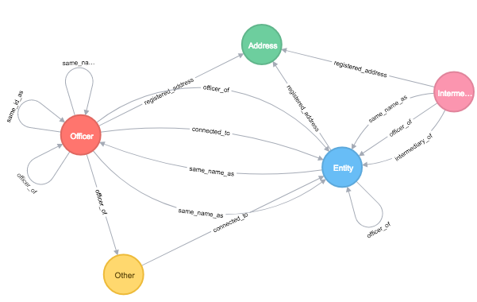

# Zweite Übungseinheit

Die Übungseinheit befasst sich mit den Panama Papers und weiteren Offshore Leaks, die in einer gemeinsamen Datenbank zusammengefasst wurden.

## Datenmodell
Das Datenmodell sieht in etwa wie folgt aus:

### Entity
Beschreibt eine juristische Person. Dies kann sowohl eine natürlich Person als auch ein Unternehmen seinn

### Officer
Beschreibt eine Verantwortliche Person (Direktor).

### Intermediary
Mittelsperson

## Frage 1
Verschaffe dir einen Überlick über die Verteilung der Entitäten auf die einzelnen Länder.

## Frage 2
Ist die CONET in den Panama Papers zu finden?

Nein, aber der Eigentümer der CONET die H.I.G.

## Frage 3
Ein Key Player der Panama Paper ist die Anwaltskanzleit Mossack Fonseca. Wie viele Entities, Intermediaries und Officiers gibt es, die jeweils diesen Namen enthalten.

## Frage 3
Welche Deutschen Entities stehen mit aauf der Liste? Kommt dir etwas bekannt vor?

## Frage 4
In Azerbaijan steht Präsident Ilham Aliyev unter Verdacht Stuern zu hinterziehen. Findet alle Offshorefirmen die mit seiner Familie in Verbindung gebracht werden können.

## Frage 5
Über welche Pfade wurden die Offshore Firmen der Aliyevs registriert?

## Frage 6
Welche Offshore Firmen nutzt Apple um Steuern zu sparen. Wie sieht das Netzwerk dahinter aus?

## Frage 7
Queen Elisabeth II taucht als "The Duchy of Lancaster" ebenfalls in den Panama Papern auf. an welchen Offshore Firmen ist sie beteiligt? Was wird daran kritisiert?

## Frage 8
Das frühere Mitlgied der Fifa Ethikkomission Juan Pedro Damiani ist eine ganz große Nummer im Geschäft mit den Offshore Firmen. Gelingt es dir alles aufzudecken wo er seine FInger im Spiel hat?

## Frage 9
Erstelle eine Liste der Top 10 Intermediaries basirend auf der Anzahl der registrierten Unternehmen. 
